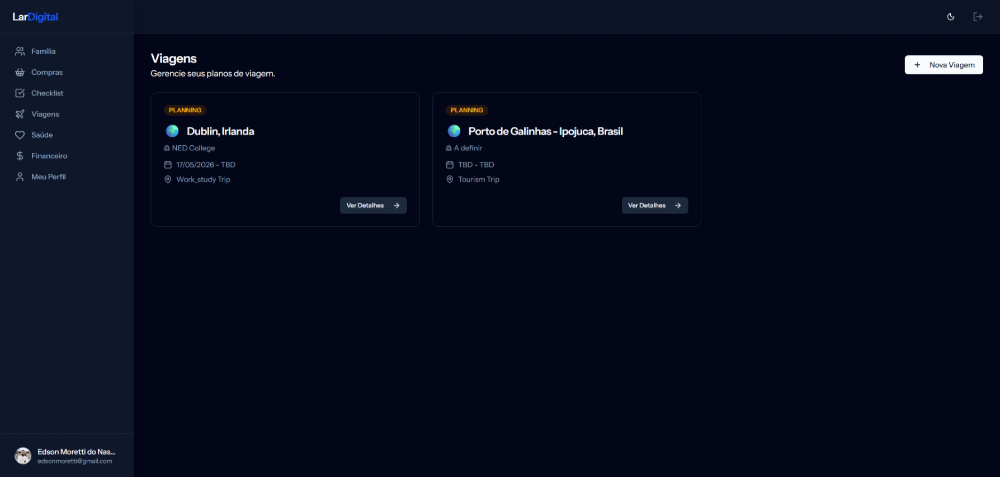

# LarDigital - Gerenciador do Seu Lar



LarDigital é uma aplicação web de código aberto, construída com o objetivo de simplificar o planejamento e a gestão de viagens, sejam elas de estudo, intercâmbio ou lazer. O projeto nasceu como um sistema de gestão de intercâmbios e foi adaptado para se tornar uma ferramenta mais flexível e abrangente.

## ✨ Funcionalidades Principais

- **Gestão de Viagens:** Crie e gerencie múltiplas viagens, definindo destinos, datas e locais de interesse.
- **Checklist de Tarefas:** Organize todas as suas pendências, desde a compra de passagens até a renovação do passaporte.
- **Planejamento Financeiro:** Crie orçamentos para diferentes categorias (moradia, alimentação, etc.) e acompanhe seus gastos.
- **Lista de Compras:** Planeje os itens que precisa comprar antes e durante a viagem.
- **Gestão de Documentos:** Mantenha um registro de todos os seus documentos importantes, com datas de validade e arquivos anexados no Google Drive.
- **Múltiplos Participantes:** Adicione membros à viagem e gerencie membros da família para organizar tarefas e documentos em grupo.
- **Gestão de Moradia:** Planeje e gerencie opções de hospedagem para suas viagens, incluindo custos e datas.
- **Eventos:** Organize e acompanhe eventos importantes durante a viagem.
- **Itinerário Detalhado:** Crie um cronograma detalhado com atividades, horários, locais e custos.
- **Rastreamento de Compras:** Acompanhe compras e despesas realizadas durante a viagem.
- **Gerenciamento de Perfil:** Atualize suas informações pessoais, senha e configurações de conta.
- **API REST:** Endpoints para integração com outras aplicações ou desenvolvimento de apps móveis.

## 🚀 Tecnologias Utilizadas

O projeto foi construído utilizando um conjunto de tecnologias modernas, focando em uma experiência de desenvolvimento ágil e uma interface de usuário reativa.

- **Backend:**
  - [Laravel](https://laravel.com/) - Um framework PHP robusto e elegante.
  - [Inertia.js](https://inertiajs.com/) - Para criar aplicações de página única (SPA) sem a complexidade de uma API completa.
- **Frontend:**
  - [React](https://react.dev/) - Uma biblioteca JavaScript para construir interfaces de usuário.
  - [TypeScript](https://www.typescriptlang.org/) - Para adicionar tipagem estática e segurança ao JavaScript.
  - [Tailwind CSS](https://tailwindcss.com/) - Um framework CSS "utility-first" para um design rápido e customizável.
  - [shadcn/ui](https://ui.shadcn.com/) - Uma coleção de componentes de UI reusáveis.

## ⚙️ Como Executar o Projeto

1. **Clone o repositório:**
   ```bash
   git clone [URL_DO_SEU_REPOSITORIO]
   cd tein-intercambio
   ```

2. **Instale as dependências:**
   ```bash
   composer install
   npm install
   ```

3. **Configure o ambiente:**
   - Copie o arquivo `.env.example` para `.env`.
   - Gere a chave da aplicação: `php artisan key:generate`
   - Configure as variáveis de banco de dados no arquivo `.env`.

4. **Execute as migrações e os seeders:**
   ```bash
   php artisan migrate --seed
   ```

5. **Inicie os servidores:**
   ```bash
   # Em um terminal
   php artisan serve

   # Em outro terminal
   npm run dev
   ```

Agora você pode acessar a aplicação em `http://localhost:8000`.

## 🔐 Configuração da Autenticação Google

Para habilitar o login com Google, você precisa obter as chaves do Google (Client ID e Secret) e configurá-las no arquivo `.env`.

### Como obter as chaves do Google (Client ID e Secret)

1. Acesse o [Google Cloud Console](https://console.cloud.google.com/).
2. Crie um Novo Projeto (ou selecione um existente).
3. No menu lateral, vá em **APIs e Serviços > Credenciais**.
4. Clique em **+ CRIAR CREDENCIAIS** (no topo) > **ID do cliente OAuth**.
5. Se pedir para configurar a "Tela de consentimento OAuth" primeiro:
   - Escolha **Externo**.
   - Preencha o nome do App (LarDigital) e email de suporte.
   - Avance até o final.
6. De volta à criação de ID do cliente:
   - Tipo de Aplicativo: **Aplicação da Web**.
   - Nome: LarDigital Web (exemplo).
   - URIs de redirecionamento autorizados: Adicione `http://localhost:8000/auth/google/callback` (altere a porta se você não usa a 8000, mas no seu `.env` o padrão é local).
   - Clique em **Criar**.
7. Uma janela vai abrir com **Seu ID de cliente** e **Sua chave secreta de cliente**.
8. Copie e cole no seu arquivo `.env`:
   ```
   GOOGLE_CLIENT_ID=seu_id_aqui
   GOOGLE_CLIENT_SECRET=sua_secret_aqui
   ```

### Resolvendo Erro 403: access_denied (ambiente de teste/dev)

Esse erro (403: access_denied) ocorre porque sua aplicação no Google Cloud está configurada como "Test" (Teste) e você não adicionou seu e-mail como testador, OU porque você pediu um escopo sensível (Google Drive) e o app ainda não foi verificado.

**Como resolver imediatamente (Modo Teste):**

1. Volte ao Google Cloud Console.
2. Vá em **APIs e Serviços > Tela de consentimento OAuth**.
3. Você verá que o "Status de publicação" está como **Teste**.
4. Role para baixo até a seção **Usuários de teste**.
5. Clique em **+ ADD USERS** (Adicionar usuários).
6. Adicione o e-mail que você está tentando usar para logar (ex: seu.email@gmail.com).
7. Use o mesmo e-mail que está sofrendo o bloqueio.
8. Salve.
